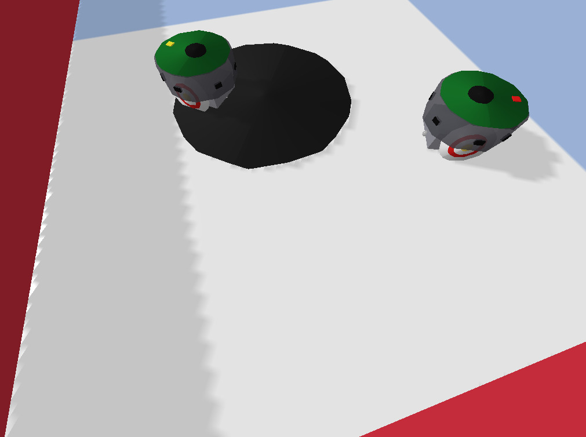

# easagru

  

  

Code and data for the paper *The value of information and the emergence of communication in evolved e-puck robots*.

Two e-puck robots, rebuilt from the official Webots model and validated in
PyBullet, must find a food patch they can only detect with their ground
sensors. They can emit a one-bit signal whose bearing and strength the
partner perceives. Each robot is controlled by a Res-GRU (GRU with a residual
input-output path), alone or as one channel of the EASA basal ganglia
architecture. The fitness only measures the time spent on the food.

## Install

    pip install -r requirements.txt

Python 3.9+ tested. Results in the paper were obtained on one machine (Mac
mini M1): physics is not bit-identical across platforms, so a re-run on
another machine gives statistically equivalent, not identical, trajectories.

## Rebuild the paper's tables (no simulation, seconds)

    python3 easagru_stats.py

Writes `results_tables/`: Table 3 (small arena), Table 4 (evolved basal
ganglia priorities), Table 5 (big arena) and `statistical_tests.txt` (paired
Wilcoxon tests, Welch t-test between conditions).

## What is in runs/

One folder per evolution run (condition_seed; `_big` = evolved in the 1.5 m
arena): `run_config.json` (all settings, library versions), `evolution_log.csv`
(one row per generation), `champion.npy` (the evaluated genome),
`evaluation_<run>.csv` (100 test episodes x signal normal/off/random),
`diagnosis_<run>.txt` (behaviour and signal specificity). `runs/robustness/`
holds the robustness test. Checkpoints and per-generation genomes are not
included (size); every run can be regenerated with the commands below.

| Folder | Condition |
|---|---|
| gru_s1..s3 | Res-GRU alone |
| easa_evo_s1..s3 | EASA with evolved priorities + Res-GRU |
| easa_safe_s1 | EASA with hand-set priorities |
| easa_s1 | EASA with an innate eat channel |
| gru_compass_s1 | Res-GRU alone + compass to the food |
| gru_big_s1..s3 | Res-GRU alone, evolved in the 1.5 m arena |

## Watch a champion (PyBullet window)

    python3 easagru_standalone.py --brain gru --genome runs/gru_s1/champion.npy
    python3 easagru_standalone.py --brain gru --task big --genome runs/gru_s1/champion.npy
    python3 easagru_standalone.py --brain easa_evo --genome runs/easa_evo_s1/champion.npy
    python3 easagru_standalone.py --brain gru_compass --genome runs/gru_compass_s1/champion.npy

Use the run's condition as `--brain` and `--task big` for runs evolved in the
big arena. Add `--signal off` or `--signal random` to watch the signal
ablations. Keys: SPACE fast mode, P pause, T sensor rays, N channel labels,
L console log, F camera follows robot A, R new episode, Q quit. The front LED
turns yellow while a robot emits. Every step is logged to `easagru_log.csv`
(disable with `--nolog`).

## Validate the robot model

    python3 test_step1_kinematics.py

Checks the e-puck against the Webots kinematics: straight-line speed
(expected 0.1256 m/s), spin rate on its axis (expected 4.83 rad/s) and tilt
at rest. All experiments use physics at 120 Hz, with the controller acting
every 8 steps (66.7 ms). On the machine used for the paper this gave
0.1255 m/s and 4.62 rad/s, against 0.1253 m/s and 4.65 rad/s at 240 Hz.

To repeat the check at 240 Hz, set in `easagru_config.json`

    "timestep": 0.00416667,
    "control_period_steps": 15

run the test, and restore the original values (`0.00833333` and `8`)
afterwards. The remaining validation tests (sensors, environment, basal
ganglia) run with `scripts/run_tests.sh`.

## Re-run the experiments

    scripts/run_tests.sh                          # validation of robot, sensors, environment, BG (~6 min)
    scripts/run_evolution.sh gru 1                # one evolution (~6 h on a Mac mini M1, 6 workers)
    scripts/run_evolution.sh gru 1 big            # big arena (~9 h)
    python3 easagru_evaluate.py --run gru_s1 --use-champion --episodes 100
    scripts/diagnose_run.sh gru_s1
    scripts/robustness.sh
    scripts/signal_value_big.sh

Conditions: `gru`, `gru_compass`, `easa_safe`, `easa`, `easa_evo`. With a
freshly evolved run (which has `best_genomes/`), `scripts/evaluate_run.sh
<run> --episodes 100` also selects the champion as in the paper.

## Files

- `easagru_world.py`, `easagru_sensors.py`, `easagru_signal.py`, `easagru_env.py`:
  robot, sensors, one-bit signal, two-robot foraging task (PyBullet).
- `easagru_bg.py`: EASA basal ganglia core (checked against `easa_ref/bg_core.py`).
- `easagru_brain.py`: Res-GRU, innate channels, EASA variants, conditions.
- `easagru_evolve.py`: genetic algorithm (homogeneous team, implicit fitness).
- `easagru_evaluate.py`, `easagru_diagnose.py`, `easagru_robustness.py`,
  `easagru_signal_value.py`, `easagru_stats.py`: evaluation and tables.
- `easagru_standalone.py`, `easagru_log.py`: GUI viewer and its step log.
- `robots/`: e-puck URDF (generated by `make_epuck_urdf.py`); `webots_ref/`:
  the Webots protos all measurements come from (Apache 2.0).

## How to cite

If you use this code or data, please cite the archived version:

Montes-González, F. M. (2026). *easagru: emergence of a one-bit signal in two
e-puck robots with a Res-GRU and EASA basal ganglia* (Version 1.0.0)
[Software]. Zenodo. https://doi.org/10.5281/zenodo.23051976

The paper reference will be added on publication.

## License

This project is released under the [MIT License](LICENSE).

The e-puck model files in the [webots_ref](webots_ref) folder are unmodified copies from the Webots project by Cyberbotics Ltd., distributed under the [Apache License 2.0](https://www.apache.org/licenses/LICENSE-2.0).
